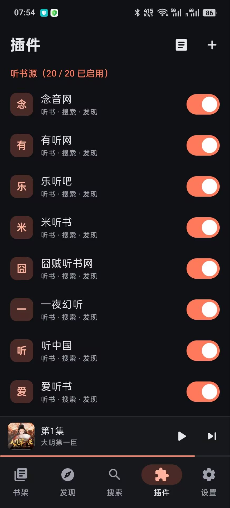

# 随身听书（安卓版）

一个聚合听书工具。程序本身只是播放器，不带任何内容：听书源来自用户导入的**插件**，也可以听自己网盘和手机里的音频。

## 界面预览

| 书架 | 发现 | 播放 | 插件 |
|:---:|:---:|:---:|:---:|
|  |  |  |  |

## 功能

**听书源**

- **插件**：从文件或网址导入 zip 插件包，一个插件可以包含多个源；支持启用、禁用、排序、删除，源的登录和设置，一键测试和调试日志
- **网盘**：内置夸克网盘、百度网盘、阿里云盘，在设置里开启并登录自己的账号后使用；每个文件夹是一本书，里面的音频是章节，可以指定只看某个目录
- **本地文件**：在设置里选择手机上的一个文件夹，子文件夹就是一本本书

**找书**

- **发现**：按源浏览分类，一键切换听书源，滚动到底自动加载下一页
- **聚合搜索**：多个源同时搜索，结果按源筛选；需要人机验证的源可以在应用内完成验证
- **书架**：收藏的书和最近播放，记住每本书听到哪一集、哪个位置

**播放**

- 后台播放，通知栏 / 锁屏 / 耳机控制
- 断点续播、自动播放下一集
- 倍速 0.5x – 3x，每本书记住自己的倍速
- 快进快退（步长可调）
- 定时关闭：本集结束后、预设时长或自定义分钟数
- 单书跳过片头片尾
- 章节倒序、按标题筛选、定位到上次听到的位置

**界面**

- 浅色、深色、跟随系统
- 7 种主题色

## 插件

这个仓库放的是插件相关的部分：开发文档、示例插件的源码和打好的插件包。

- 📦 [plugins/dist/ShunSources.zip](plugins/dist/ShunSources.zip)：打好的插件包（18 个听书源），下载后在 App 的“插件”页点 `+` →“从文件导入 zip”
- 📖 [插件开发指南](docs/plugin-development.md)：插件包结构、源的写法、宿主提供的能力、调试和打包
- 🧩 [plugins/ShunSources](plugins/ShunSources)：示例插件的源码，覆盖了文档里提到的大部分写法

插件是一个 zip，里面放一个 `manifest.json` 和若干 JavaScript 脚本，脚本里用 `registerSource({...})` 注册源：

```js
registerSource({
  id: '0f9c0b5c2d7e4c1b9a0e6f3a2b1c4d5e',
  name: '我的站点',
  url: 'https://example.com',

  search: function (keywords, page) {
    var doc = this.host.getHtml('https://example.com/search?q=' + encodeURIComponent(keywords) + '&p=' + page);
    var books = doc.select('.item').map(function (e) {
      return { coverUrl: e.first('img').absUrl('src'), bookUrl: e.first('a').absUrl('href'), title: e.first('h3').text() };
    });
    return { books: books, totalPage: page };
  },

  bookDetail: function (bookUrl) {
    var doc = this.host.getHtml(bookUrl);
    return { episodes: doc.select('#playlist a').map(function (a) { return { title: a.text(), url: a.absUrl('href') }; }) };
  },

  audio: function (episodeUrl) {
    return this.host.getHtml(episodeUrl).first('audio').absUrl('src');
  }
});
```

完整说明见[插件开发指南](docs/plugin-development.md)。

## 说明

本程序只是播放器，不提供任何内容，所有音频都来自插件访问的第三方网站或用户自己的网盘和文件，请支持正版。
插件脚本会在本机访问网络，请只导入你信任的来源提供的插件。
